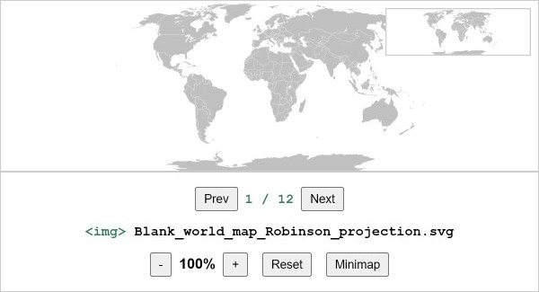

# react-viewer-pan-zoom

## Overview

> Pan and zoom elements in React using gestures, mouse, touchpad, keyboard shortcuts and UI buttons.

[](https://www.npmjs.com/package/react-viewer-pan-zoom)

## Features

* 💡 Designed to pan and zoom `<svg>` elements via `react-inlinesvg`, ``, `<svg>`, `<canvas>` and other html elements.
* 🧭 Supports minimap, spring animation, rubberband, responsive design, etc.
* 🛠️ Written in Typescript. Built on top of [use-gesture](https://github.com/pmndrs/use-gesture) and [react-spring](https://www.react-spring.dev).
* 🚀 Using fast build tools (Vite / Rollup).

## Installation

```bash
npm install react-viewer-pan-zoom
```

## Example

[](https://michelesandroni.github.io/react-viewer-pan-zoom)

Check out this live **[example](https://michelesandroni.github.io/react-viewer-pan-zoom)**.

**The layout size of the viewer must be specified via CSS**!  
Two variants of the viewer (full-window and fixed-size) are shown in `example`/`src`/`App.tsx`.

⚠️ IMPORTANT: For the full-window viewer, make sure that the main CSS file contains the following:

```css
html, html body, #root { height: 100%; margin: 0; padding: 0; }
```

## Getting Started

⚡️ Jump Start

```jsx
import { useContext } from 'react'

import { Viewer, ViewerContext, ViewerProvider } from 'react-viewer-pan-zoom'

const App = () => {

  // // Example Layout #1: Full-window viewer
  // const layoutStyle = {
  //   display: 'flex',
  //   flexDirection: 'column',
  //   userSelect: 'none',
  //   height: '100vh',
  //   // ⚠️ IMPORTANT: make sure that the main CSS file contains the following:
  //   // html, html body, #root { height: 100%; margin: 0; padding: 0; }
  // }

  // Example Layout #2: Fixed-size viewer
  const layoutStyle = {
    display: 'flex',
    flexDirection: 'column',
    userSelect: 'none',
    width: '800px',
    height: '600px'
  }

  const contentStyle = {
    width: '100%',
    height: '100%',
    objectFit: 'contain', // 'contain', 'cover', 'fill', 'scale-down', ...
    objectPosition: 'center', // 'center', 'left', 'right', ...
    border: '1px solid #ccc',
  }

  const content = 

  return (
    <div style={layoutStyle}>
      <h1 style={{}}>react-viewer-pan-zoom | example</h1>
      <ViewerProvider
        settings={{ /* ... */  }} >
        <Viewer viewportContent={content} minimapContent={content} />
        <nav>
          <Toolbar />
        </nav>
      </ViewerProvider>
    </div>
  )
}

const Toolbar = () => {
  const { settings, zoomOut, zoomIn, resetView, centerView, toggleMinimap, crop } = useContext(ViewerContext)

  return (
    <>
      <span>
        {settings.zoom.enabled && (
          <>
            <button onClick={() => zoomOut()}>-</button>
            {<strong>{(crop.zoom * 100).toFixed(0)}%</strong>}
            <button onClick={() => zoomIn()}>+</button>
            {(settings.resetView.enabled) && <button onClick={() => resetView()}>Reset</button>}
            {(settings.centerView.enabled) && <button onClick={() => centerView()}>Center</button>}
            {(settings.minimap.enabled) && <button onClick={() => toggleMinimap()}>Minimap</button>}
          </>
        )}
      </span>
    </>
  )
}

export default App
```

## Settings

Default settings:

```jsx
{
  pan: { enabled: true }, // Enable or disable panning functionality.
  
  zoom: { 
    enabled: true,         // Enable or disable zoom functionality.
    default: 1,            // Default zoom level when the viewer is loaded.
    min: 1,                // Minimum zoom level.
    max: 4,                // Maximum zoom level.
    mouseWheelStep: 0.5,   // How much zoom per mouse wheel step.
    zoomButtonStep: 0.5,   // How much zoom per zoom button click.
  },
  
  resetView: { 
    enabled: true,         // Enable or disable the "reset view" feature.
    keyboardShortcut: 'r', // The keyboard shortcut to trigger the reset view (set to `false` to disable).
  },
  
  centerView: { 
    enabled: false,        // Enable or disable the "center view" feature.
    keyboardShortcut: 'c', // The keyboard shortcut to center the view (set to `false` to disable).
  },
  
  minimap: { 
    enabled: true,              // Enable or disable the minimap.
    width: '160px',             // Width of the minimap.
    keyboardShortcut: 'm',      // The keyboard shortcut to toggle the minimap (set to `false` to disable).
    outlineStyle: '1px solid #ccc', // Outline style for the minimap.
    viewportAreaOutlineStyle: '2px solid #333', // Outline style for the viewport area on the minimap.
  },
  
  spring: { 
    enabled: true,         // Enable or disable spring animations for smooth transitions.
    rubberband: true,      // Enable or disable rubberband effect when zooming or panning.
    rubberbandDistance: 100, // Distance to trigger the rubberband effect.
  },
  
  guides: { 
    enabled: false,        // Enable or disable guides.
  },
  
  fillHeight: true,         // Set to `true` to make the viewer fill all available height in the parent container.
}
```

## License

MIT © [michelesandroni](https://github.com/michelesandroni)
